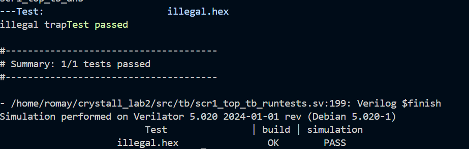
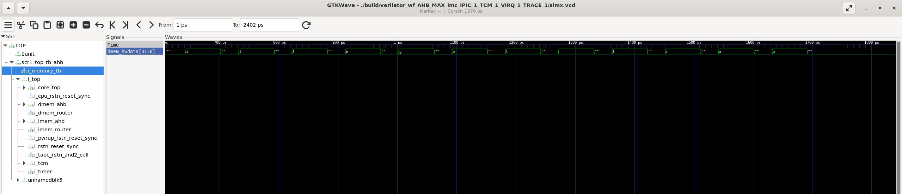

# Отчет о лабораторной работе №2

## Цель работы
Ознакомиться с возможностями настройки архитектуры системы команд, обработкой исключений/прерываний и принципами работы сборщика программ.

## Вариант задания

| Номер варианта | ФИО                | Вид исключения | Тест               | Reset Vector | Trap Vector | Обработчик         |
|----------------|--------------------|----------------|--------------------|--------------|-------------|--------------------|
| 4              | Юнусов Роман | Illegal instruction     | isa/rv32mi/illegal.S| 0x2000        | 0x1000       | Вывод строк "illegal trap"|

## Ход работы

Задание заключается в обработке исключения `Illegal instruction`, которое проверяется тестом на корректность ISA RISC-V `/isa/rv32mi/illegal.S`. Данное исключение генерируется любой инструкцией, которая не распознается процессором по текущему режиму привилегий или расширениям ISA. 

### Конфигурация тестов

Сначала отредактируем список тестов, которые должны запускаться в файле `rv32_tests.inc`:

```
ARCH_lowercase = $(shell echo $(ARCH) | tr A-Z a-z)

rv32_isa_tests += isa/rv32mi/illegal.S
```

Для запуска тестов с формированием временной диаграммы воспользуемся следующей командой:

```
make run_verilator_wf TARGETS="riscv_isa" TRACE=1
```

Важно отметить, что для запуска тестов с предоставленным тулчейном необходимо было отредактировать `Makefile` для компиляции теста следующим образом:

```
CFLAGS := -I$(inc_dir) -I$(src_dir) -DASM -Wa,-march=rv32$(ARCH) -march=rv32$(ARCH) -mabi=ilp32f -D__riscv_xlen=32
LDFLAGS := -static -fvisibility=hidden -nostdlib -nostartfiles -T$(inc_dir)/link.ld -march=rv32$(ARCH) -mabi=ilp32f
```

Изменения были во флагах компилятора, а именно в флаге `-march`, где было убрано расширение `_zifencei`, так как предоставленная версия тулчейна не поддерживает данное расширение.

Это расширение определяет инструкцию FENCE.I, которая предоставляет явную синхронизацию для доступа к памяти инструкций.

### Модификация обработки исключений

Обработка исключений объявлена в файле `/sim/tests/common/riscv_macros.h` в макросе под названием `RVTEST_CODE_BEGIN` под меткой `trap_vector`:

```
#define RVTEST_CODE_BEGIN                                               \
        .org 0x1100,0;                                                  \
        .section .rodata;                                               \
        .balign 4;                                                      \
        MSG_TRAP:                                                       \
        .asciz "illegal trap";                                          \
        .section .text.init;                                            \
        .balign  64;                                                    \
        .weak stvec_handler;                                            \
        .weak mtvec_handler;                                            \
trap_vector:                                                            \
        /* test whether the test came from pass/fail */                 \
        csrr a4, mcause;                                                \
        li a5, CAUSE_USER_ECALL;                                        \
        beq a4, a5, _report;                                            \
        li a5, CAUSE_SUPERVISOR_ECALL;                                  \
        beq a4, a5, _report;                                            \
        li a5, CAUSE_MACHINE_ECALL;                                     \
        beq a4, a5, _report;                                            \
        li a5, CAUSE_ILLEGAL_INSTRUCTION;                                     \
        bne a4, a5, skip_error_print;                                            \
        /* init for loop, 0xf0000000 address for print */               \
        lui a6, 0xf0000;                                                \
        la a7, MSG_TRAP;                                                \
next_iter:                                                              \
        lb a5, 0(a7);                                                   \
        beq a5, x0, break_from_loop;                                    \
        sw a5, 0(a6);   /* write to a6 char for print */                \
        addi a7, a7, 1;                                                 \
        jal x0,next_iter;                                               \
break_from_loop:                                                        \
        /* if an mtvec_handler is defined, jump to it */                \
        la a4, mtvec_handler;                                           \
        beqz a4, 1f;                                                    \
        jr a4;                                                          \
        /* was it an interrupt or an exception? */                      \
1:      csrr a4, mcause;                                                \
        bgez a4, handle_exception;                                      \
        INTERRUPT_HANDLER;                                              \
skip_error_print:                                                   \
        mret;                                                           \
```

Добавленная мною часть находится в блоках - `RVTEST_CODE_BEGIN`, `trap_vector`, `next_iter`, `break_from_loop`.
В `RVTEST_CODE_BEGIN` было добавлено хранение выводимой строки при исключении в секциюю rodata, также произведно её выравнивание через balign.
В `trap_vector` было добавлена проверка на тип исключения CAUSE_ILLEGAL_INSTRUCTION, если оно нужное нам, то `next_iter` занимается выводом строки. Для вывода сообщений при симуляции необходимо записать символ в память по адресу `0xf000_0000` (из Table 9. User Manual).
Переход из `next_iter` в `break_from_loop` происходит при встрече нулевого символа, который обозначает конец символа.


### Модификация парметров ядра

Данная модификация происходит в файле `./src/includes/scr1_arch_descriptions.svh`, где модифицируются параметры представленные ниже:

```
parameter bit [`SCR1_XLEN-1:0]          SCR1_ARCH_RST_VECTOR        = 'h2000;            // Reset vector value (start address after reset)
parameter bit [`SCR1_XLEN-1:0]          SCR1_ARCH_MTVEC_BASE        = 'h1000;            // MTVEC.base field reset value, or constant value for MTVEC.base bits that are hardwired
```

Первый параметр определяет значение регистра `pc` после сброса устройства. Второй параметр определяет значение регистра `mtvec` (Machine Trap-Vector), оно содержит адрес в памяти (`BASE`), на который будет изменен регистр `pc` при срабатывании ловушки. При заданной мне конфигурации обработка исключений работает в режиме `DIRECT`, когда любое исключение переводит `pc` в значение `BASE`.

### Модификация linker-скрипта

Linker-скрипт - это скрипт, который описывает расположение секций в памяти. Измененный linker-файл приведен ниже:

```
SECTIONS {

  /* code segment */
  .text.init 0 : { 
    FILL(0);
    . = 0x100 - 12;
    SIM_EXIT = .;
    LONG(0x13);
    SIM_STOP = .;
    LONG(0x6F);
    LONG(-1);
    . = 0x1000;
    PROVIDE(__TEXT_START__ = .);
    *(.text.init) 
  } >RAM
  
  .text.start 0x2000: { 
    PROVIDE(__TEXT_END__ = .);
    PROVIDE(__TEXT_START__ = .);
    *(.text.start) 
  } >RAM

  ...
}
```

В скрипте сначала объявляется расположение секции `.text.init`, внутри которой указывается что надо добавить и по какому адресу расположить сам код. Также изменено положение трап вектора с 0100 до 1000. Также в скрипт добавлено расположение секции .text.start, которая соответствует коду, который должен исполняться по сбросу устройства.

### Компиляция и запуск теста 

После компиляции получен стектрейс, dump-файл и временная диаграмма исполнения теста процессором. Результаты теста, а также сообщение выведено в консоль.



Информация о пройденном тесте, а также выведенное сообщение `illegal trap`. Процесс того, как сработало прерывание можно увидеть в трейселоге.

```
# =====================================================================================
# Test: sbreak.hex
#           Time   Ev  Curr_PC    Instr      Next_PC    Reg        Value     
# =====================================================================================
...
              37   E   00003104   00000000   00001000   mtval      00000000
              40   N   00001000   000047a1   00001004   x14_a4     00000002
              41   N   00001004   04f70763   00001006   x15_a5     00000008
              42   N   00001006   000047a5   0000100a   ---        --------
              43   N   0000100a   04f70463   0000100c   x15_a5     00000009
              44   N   0000100c   000047ad   00001010   ---        --------
...
             209   E   00003218   00000013   00001000   mstatus    00001800
             209   E   00003218   00000013   00001000   mepc       00003218
             209   E   00003218   00000013   00001000   mcause     0000000b
             209   E   00003218   00000013   00001000   mtval      00000000
             212   N   00001000   000047a1   00001004   x14_a4     0000000b
             213   N   00001004   04f70763   00001006   x15_a5     00000008
             214   N   00001006   000047a5   0000100a   ---        --------
             215   N   0000100a   04f70463   0000100c   x15_a5     00000009
...
```

Здесь виден переход от исполнения теста к обработке прерывания по смене адреса исполняемой инструкции на `1000`, а также возникновения события `E`, что сигнализирует об исключении.

На временной диаграмме мы также можем увидеть, как по определенному адресу было записано предложение, вызванное обработчиком прерывания.



## Вывод

Данная работа демонстрирует взаимосвязь между аппаратными параметрами и расположением программ в памяти. При ручном задании карты памяти устройства, надо вручную прописывать расположение секций программы в памяти устройства с помощью линкер-скриптов.